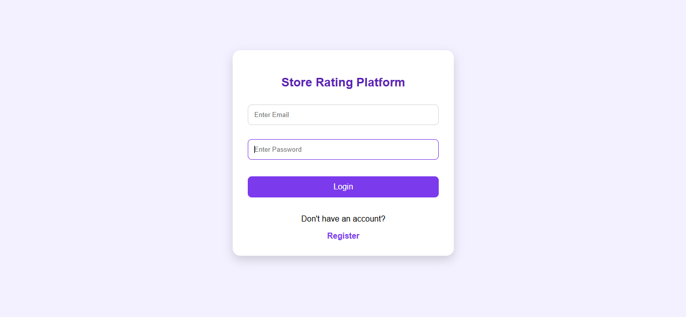
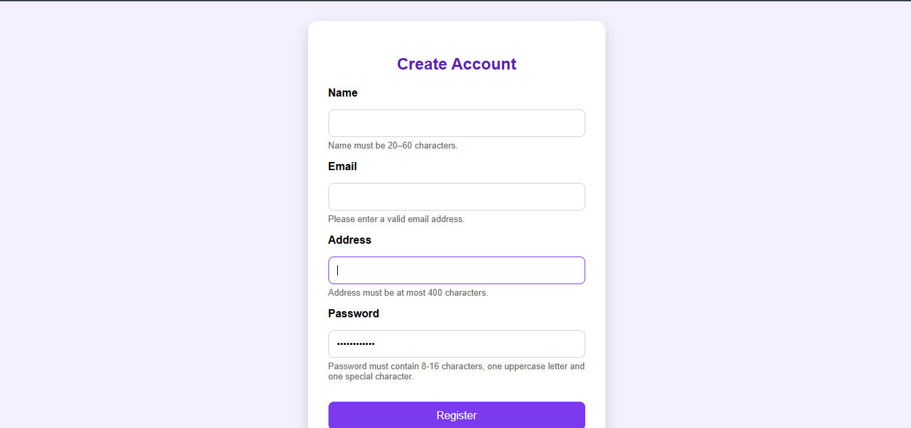
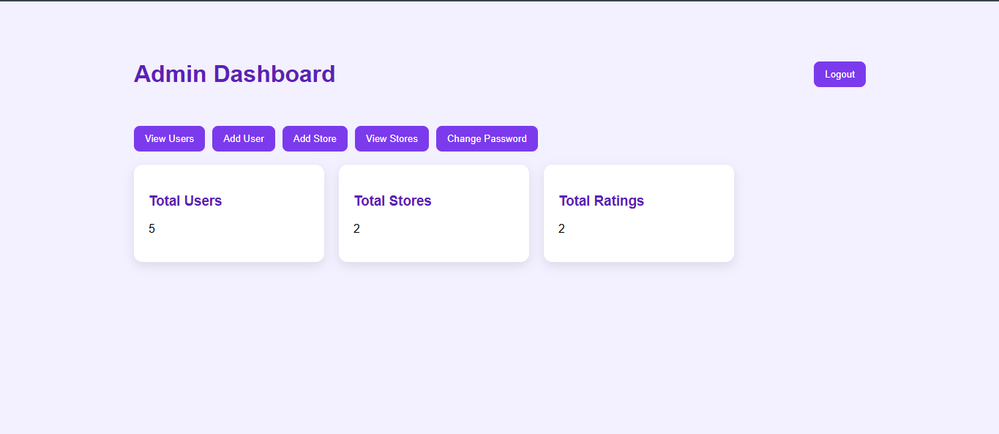
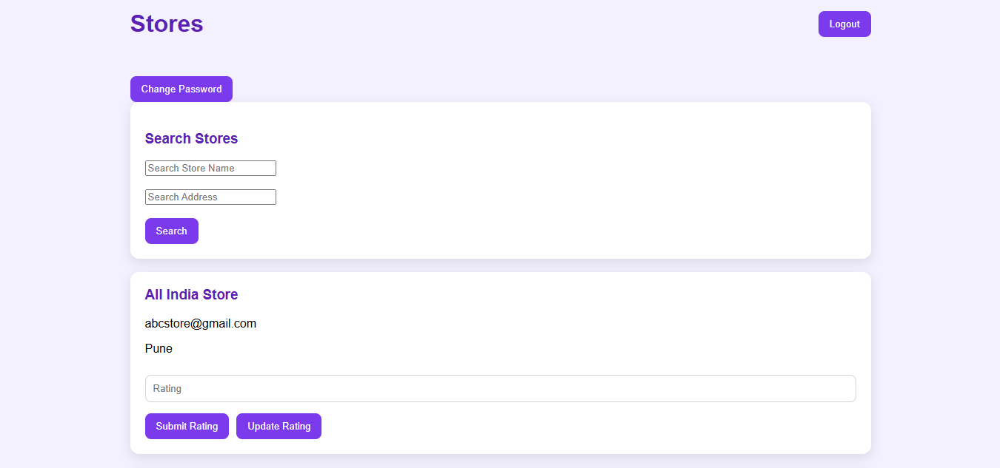
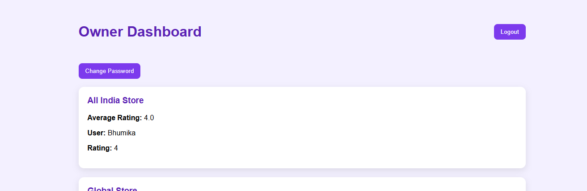

# ⭐ Store Rating Platform

A full-stack web application that enables users to discover stores, submit ratings, and manage store information through role-based access control.

Built using **React.js**, **Node.js**, **Express.js**, **MySQL**, and **JWT Authentication**.

---

## 📌 Features

### 🔐 Authentication & Security

* User Registration
* User Login
* JWT-Based Authentication
* Secure Password Hashing using bcrypt
* Change Password Functionality
* Protected Routes
* Role-Based Authorization

### 👨‍💼 Admin Features

* View Dashboard Statistics

  * Total Users
  * Total Stores
  * Total Ratings
* Add New Users
* Add New Stores
* View All Users
* Search Users by Name and Email
* View Store Listings

### 🏪 Store Owner Features

* View Owned Stores
* View Ratings Submitted by Users
* View Average Store Rating
* Change Password

### 👤 User Features

* Browse Stores
* Search Stores by Name
* Search Stores by Address
* Submit Ratings (1–5)
* Update Previously Submitted Ratings
* Change Password

---

## 🛠️ Tech Stack

### Frontend

* React.js
* React Router DOM
* Axios
* CSS

### Backend

* Node.js
* Express.js
* JWT Authentication
* bcrypt

### Database

* MySQL

---

## 📂 Project Structure

```text
Store-Rating-Platform/
│
├── backend/
│   ├── config/
│   ├── controllers/
│   ├── middleware/
│   ├── routes/
│   ├── server.js
│   └── package.json
│
├── frontend/
│   ├── src/
│   │   ├── pages/
│   │   ├── services/
│   │   ├── styles/
│   │   ├── App.jsx
│   │   └── main.jsx
│   └── package.json
│
├── screenshots/
│
├── README.md
└── .gitignore
```

---
## 📸 Application Screenshots

### Login Page



### Register Page



### Admin Dashboard



### Stores Page



### Owner Dashboard



## ⚙️ Installation & Setup

### 1. Clone the Repository

```bash
git clone https://github.com/YOUR_USERNAME/store-rating-platform.git
```

### 2. Backend Setup

```bash
cd backend
npm install
```

Create a `.env` file:

```env
PORT=5000
JWT_SECRET=your_secret_key
```

Start Backend Server:

```bash
nodemon server.js
```

---

### 3. Frontend Setup

```bash
cd frontend
npm install
npm run dev
```

---

## 🗄️ Database Setup

Create a MySQL database and configure the database connection in:

```text
backend/config/db.js
```

Required Tables:

* users
* stores
* ratings

---

## 🔒 Security Features

* JWT Authentication
* Password Hashing with bcrypt
* Protected API Routes
* Role-Based Access Control
* Backend Input Validation

---


## 👩‍💻 Author

**Shrushti Kamate**

FullStack Developer


